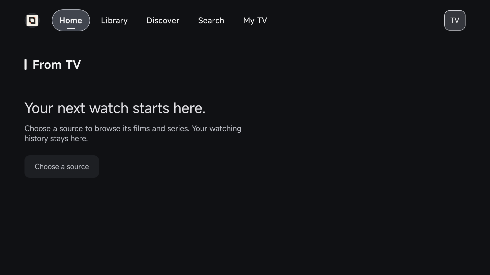
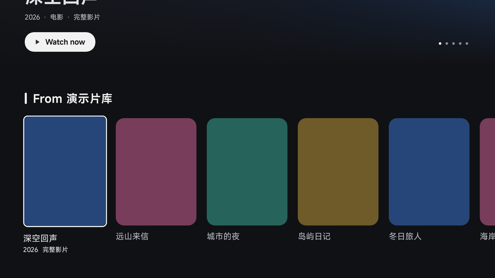

# Codespace 验证记录

验证日期：2026-10-04。
接续 Claude 会话 `e3207796-251e-4a2e-901b-4c2acf88ba12`，完成其未完成的模拟器安装、启动和截图验证。

## 实际环境

- 专用测试 Codespace：`tv-env-test-4core-pj4x67r9vwwr27wwr`，4 核、约 16GB 内存、32GB 磁盘。
- TV 主仓库提交 `b7c0ae164`，UI 工作树提交 `a9c65efa9`；没有覆盖工作树或替换为其他 UI 版本。
- JDK `21.0.12.1`，构建用 Python `3.10.22`。
- Android SDK `37.0` / build-tools `37.0.0`，emulator `37.2.12.0`。
- AVD `tv_ui_api24`，x86_64 / API 24，1920×1080 / 320dpi，KVM 加速。

## 已验证

1. 完整 ARM64 debug 构建：复核原会话保留的 `/workspaces/build-final.log` 与实际 APK，`BUILD SUCCESSFUL in 8m 3s`，430 个任务。此轮没有修改 TV 源码，因此复用了该构建产物。
2. 模板更新后，系统检查、仓库准备、Python / 测试素材安装再次执行成功；既有 UI 工作树仍然干净。
3. Dev Containers CLI `0.89.0` 成功解析配置，并解析 Java、Python、GitHub CLI、Node 四个 Feature。
4. 本地与 Codespace 的 6 项回归检查均通过：测试源配置与搜索、首页空态与详情、视频 Range、跨目录 `.env`、模拟器提前退出诊断、重复引导保留现有工作。
5. 在独立临时目录从零生成图片和 120 秒 H.264 / AAC 样片，启动测试源成功；`bytes=0-15` 返回 16 字节，ffprobe 确认时长 `120.000000` 秒。
6. 模拟器开机 `sys.boot_completed=1`；UI 测试包安装返回 `Success`，启动 HomeActivity 返回 `Status: ok`，进程存活，启动窗口内没有 AndroidRuntime 崩溃记录。
7. 在 App 中配置 `http://10.0.2.2:8765/config.json`，返回首页后显示演示片库、深空回声、远山来信等虚构影片与海报。
8. 完成截图并检查画面与分辨率，见下图。





## APK 校验

原始 ARM64 APK（98,087,150 字节）：

```text
7bacd8abf70a00fbe944e97fc15c76e7664ddd7ccb3a8b0768ba7a7228f65c49
```

x86 UI 测试包（57,215,716 字节；已通过 apksigner 验证）：

```text
f565c2943a1406a89145e98f979909f5cddbaec5d4a9e63ec04c5516f4fcea87
```

APK 保存在测试 Codespace，不提交到模板仓库。UI 包跳过 Python 初始化并替换原生库，仅用于界面验证，不作为真机播放或发布验证。

## 修复与容量结论

原脚本在模拟器已经因磁盘不足退出后仍然等待开机，表现为长时间超时。
日志实际报告：可用约 5.9GB，需要约 7.4GB。
新版 emulator 会把数据分区提高到至少 6GB，即使 config.ini 或 `-partition-size` 请求更小的容量也一样。
本轮只清理该专用测试机可重建的 Gradle transforms 和 app intermediates，保留 APK、源码与依赖包，然后成功开机。
模板默认推荐至少 64GB 存储，不依赖自动清理用户缓存来运行；失败时会立即输出模拟器日志。

KVM 启动使用设备真实 gid，并保留用户 HOME，避免模拟器试图读取 `/root/.emulator_console_auth_token`。最终版脚本完成一次停止、重新开机及 App 再启动；模拟器控制台返回 `tv_ui_api24 / OK`，该 HOME 错误不再出现。

## 验证边界

完整环境与 App 启动是在已有 Codespace 上使用引导脚本验证的；自定义 Docker 镜像与四个 Feature 的组合未另外执行一次完整镜像构建。
Devcontainer 的 JSON、Feature 解析和复用的引导脚本均已检查。Tailscale 新节点登录与 release 签名未执行，需要用户自己的配置。
